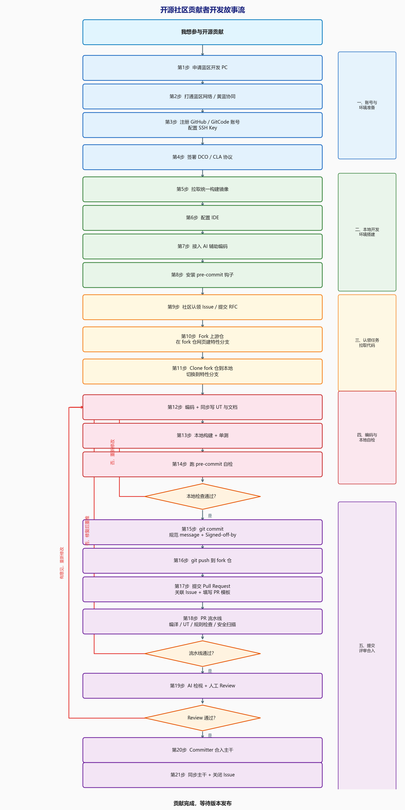

# 开源社区贡献者从0到1实操指南

> 🎯 **本文档面向谁**
> 第一次参与蓝区开源社区贡献的工程师。无论你是刚入职的新员工、转岗到开源团队的老员工，还是想给社区提交第一个 PR 的同学，本文档都将手把手带你走完一次完整的贡献旅程。
>
> 📦 **示例项目**：以参与 [triton-ascend](https://github.com/triton-lang/triton-ascend) 贡献为例。其它蓝区开源项目（如 [openEuler/ham](https://github.com/openeuler/ham)、[MindSpore](https://github.com/mindspore-ai/mindspore) 等）流程一致，只需替换仓库地址。

---

## 📍 开发故事流总览

下图描绘了一名贡献者从"零基础"到"代码合入主干"的完整故事流。每个节点都对应本文档中的一个章节，按图索骥即可。



**整体可分为 5 个阶段**：

| 阶段 | 步骤 | 一次性 / 每次都做 |
|------|------|-------------------|
| 一、账号与环境准备 | 1–4 | ⏱ **一次性**（首次贡献做一遍） |
| 二、本地开发环境搭建 | 5–8 | ⏱ **一次性** |
| 三、认领任务并拉取代码 | 9–11 | 🔁 每次贡献 |
| 四、编码与本地自检 | 12–14 | 🔁 每次贡献 |
| 五、提交、评审、合入 | 15–21 | 🔁 每次贡献 |

---

## 阶段一：账号与环境准备（首次必做，仅做一次）

### 第1步 申请蓝区开发 PC

> ⚠️ **为什么要用蓝区 PC**：蓝区 PC 是访问 github.com 等公网开源社区的**唯一合规通道**。**严禁**在黄区 PC 上直接 clone / push 开源仓代码。

**申请入口**：

- 🔗 蓝区 PC 申请指引：<https://wiki.huawei.com/domains/987/wiki/16328/WIKI202509158280876>

**申请表关键字段填写建议**：

- **操作系统**：Ubuntu 20.04+ 或 openEuler 22.03 LTS（建议与目标项目的构建镜像一致）
- **网络权限**：明确写出"需要访问 `github.com` / `gitcode.com` / `pypi.org`"
- **磁盘容量**：≥ 500 GB（triton-ascend 含子模块约 30 GB，构建产物再占 20+ GB，预留缓冲）
- **内存**：≥ 32 GB（编译 LLVM/MLIR 时较吃内存）

申请周期通常为 **3–5 个工作日**，等待期可同步推进第 3 / 4 步。

### 第2步 打通蓝区网络

PC 到手后，先做一轮"网络体检"：

```bash
# 验证 github 可达
curl -I https://github.com         # 期望 HTTP/2 200 或 301

# 验证 gitcode 可达
curl -I https://gitcode.com

# 验证 pypi 可达
pip config list                     # 检查源是否已配置为蓝区可用源
```

**黄蓝协同**（开发过程中难免要在蓝/黄区之间倒文件）：

- **蓝 → 黄**：直接 push 到 github 仓，然后在黄区 PC 下载；小文件可邮件
- **黄 → 蓝**：使用黄蓝文件同步助手 <https://wiki.huawei.com/domains/4971/wiki/82756/WIKI2026022710230136>

**踩坑预警**：

- ❌ 不要在蓝区 PC 上配置黄区代理，否则 git clone 会被拦截
- ❌ 蓝区 PC 不要登录 W3 账号（黄蓝合规红线）

### 第3步 注册开源账号并配置 SSH Key

| 平台 | 用途 | 注册建议 |
|------|------|----------|
| **[GitHub](https://github.com/signup)** | triton-ascend 等上游开源仓托管平台 | 用个人/工作邮箱注册，**完善实名信息**（贡献会被记录在 contributors 列表） |
| **[GitCode](https://gitcode.com/)** | 蓝区代码镜像 + PR 流水线 | 用华为邮箱注册 |
| **GPG 密钥**（可选） | commit 签名（部分严格社区要求） | `gpg --gen-key` |

**配置 git 身份与 SSH Key**：

```bash
# 1. 配置 git 全局身份（邮箱必须与 GitHub 注册邮箱一致，否则 DCO 校验失败）
git config --global user.name  "Your Name"
git config --global user.email "your_name@example.com"

# 2. 生成 SSH Key
ssh-keygen -t ed25519 -C "your_name@example.com"
# 一路回车即可，密钥默认放在 ~/.ssh/id_ed25519

# 3. 复制公钥
cat ~/.ssh/id_ed25519.pub

# 4. 上传到 GitHub：https://github.com/settings/keys → New SSH key
#    上传到 GitCode：https://gitcode.com/-/profile/keys → 添加公钥

# 5. 验证连通性
ssh -T git@github.com    # 期望输出 "Hi <your-name>! You've successfully authenticated..."
ssh -T git@gitcode.com
```

### 第4步 签署 DCO / CLA 协议

开源社区通常要求贡献者签署以下协议之一：

- **DCO（Developer Certificate of Origin）**：开发者证明书。每个 commit 必须带 `Signed-off-by:` 行，表示你确认有权贡献该代码。规范见 <https://developercertificate.org/>
- **CLA（Contributor License Agreement）**：贡献者许可协议。首次提交 PR 时机器人会自动评论提示签署。

**操作要点**：

```bash
# commit 时使用 -s 参数自动追加 Signed-off-by
git commit -s -m "feat(ops): add fused softmax kernel"

# 如果 commit 时忘了加 -s，可以补签
git commit --amend -s --no-edit
```

> 📝 triton-ascend 当前要求 DCO 签名。如果你给其它项目（如 OpenAtom 系）贡献，可能还需要签 CLA，按 PR 评论里 bot 的提示链接签即可。

---

## 阶段二：搭建本地开发环境（首次必做，仅做一次）

### 第5步 拉取统一构建镜像（强烈推荐）

为了规避"我的机器能跑，你的机器跑不起来"的环境差异，建议使用蓝区**统一构建镜像**。

```bash
# 拉取镜像（具体地址以发布团队公告为准，请向项目维护团队索取最新镜像名）
docker pull <蓝区镜像仓>/triton-ascend-dev:latest

# 启动开发容器（挂载工作目录 + Ascend 设备）
docker run -it --name triton-dev \
  -v $HOME/workspace:/workspace \
  --device=/dev/davinci0 --device=/dev/davinci_manager \
  --device=/dev/devmm_svm --device=/dev/hisi_hdc \
  -v /usr/local/Ascend/driver:/usr/local/Ascend/driver \
  -v /usr/local/dcmi:/usr/local/dcmi \
  -v /usr/local/bin/npu-smi:/usr/local/bin/npu-smi \
  <蓝区镜像仓>/triton-ascend-dev:latest /bin/bash
```

镜像内已预装：CANN 工具链、LLVM/MLIR、Python 3.10、CMake、Ninja、ccache、git、pre-commit 等。

> 🚫 不推荐手动逐项安装依赖：CANN 与 LLVM 版本对齐很容易踩坑。

### 第6步 配置 IDE

> 🔗 **IDE 开箱即用配置指引**：（链接待补充）

### 第7步 接入并使用 AI 辅助编码

> 💡 **核心理念**：AI 辅助开发已经是当下开源开发的"标配生产力"，**会用 AI 的开发者的有效产出是不会用的 3–5 倍**。蓝区已经提供成熟的 AI 编码工具链，请务必接入。

#### 7.1 接入蓝区 AI 编码助手

- 🔗 **AI 辅助编码接入指引**：<https://wiki.huawei.com/domains/5248/wiki/53557/WIKI2026030610317377>

按上面 wiki 完成插件安装、账号授权、IDE 集成后，即可在 VS Code / JetBrains 系列 IDE 中获得：

| 能力 | 触发方式 | 适用场景 |
|------|----------|----------|
| **代码补全** | 输入时自动出现灰色建议，`Tab` 接受 | 写算子骨架、循环、boilerplate |
| **注释生成代码** | 在函数上方写中文/英文注释，回车触发 | 实现已有规格的小函数 |
| **代码解释** | 选中代码 → 右键 → Explain | 读懂他人提交的复杂模板 |
| **单测生成** | 选中函数 → 右键 → Generate UT | 快速补齐测试用例 |
| **代码评审** | 在 PR diff 上触发 | 自查潜在 bug |
| **commit message 建议** | 暂存改动后调用 | 生成 Conventional Commits 格式 |

#### 7.2 接入计算产品线 Skill 市场

针对 Ascend / Triton 等特定领域，还可以使用预制 Skill（提示词模板）提高准确率：

- 🔗 **蓝区 Skill 市场**：<https://openlibing.com/apps/ai/skillhub>
- 🔗 **黄区 Skill 市场**：<https://agent.huawei.com/agent/skill>

例如可以直接搜索"Triton kernel 优化"、"Ascend 算子调优"等 Skill，一键加载到 IDE。

> 🚨 **合规红线**：
> - ❌ **禁止**把内部代码 / 密钥 / 客户数据贴到公网 AI 工具（ChatGPT、Claude.ai 等）
> - ✅ 必须使用蓝区授权的 AI 工具（链接见上）
> - ❌ AI 生成的代码不能直接打 `Signed-off-by`——你必须**逐行阅读、理解、修改**后才能算"你的贡献"，DCO 才合法

### 第8步 安装并启用 pre-commit

> 💎 **核心理念**：把 PR 流水线的检查规则下沉到本地 commit 时刻，**让代码在 push 前就能发现 99% 的格式 / 静态检查问题**，避免反复 push 反复挂红灯。

```bash
# 1. 安装 pre-commit
pip install pre-commit

# 2. 进入项目根目录（先要 clone 仓库，见第11步；首次配置环境时可以先跳过这一步）
cd /workspace/triton-ascend

# 3. 在 .git/hooks 下注册 pre-commit 钩子
pre-commit install

# 4. 同时启用 commit message 校验
pre-commit install --hook-type commit-msg

# 5. 首次跑一遍全量自检（会下载所有 hook 工具，耗时 3–10 分钟）
pre-commit run --all-files
```

**官方 pre-commit 平台入口**（含 IDE 插件、配置模板、规则查询）：

- 🔗 蓝区 pre-commit portal：<https://portal.libing.huawei.com/card/userFeedBack?hideSide=true&hideNotice=true&hideHelp=true&param=precommit>

---

## 阶段三：认领任务并拉取代码（每次贡献都做）

### 第9步 在社区认领 Issue / 提交 RFC

**对小修小补（bug fix、文档、typo）**：

1. 浏览 [triton-ascend issues](https://github.com/triton-lang/triton-ascend/issues)，筛选 `good first issue` / `help wanted` 标签
2. 在目标 issue 下评论 `/assign` 或 "I would like to work on this"，等待 Maintainer 回复确认
3. 一旦认领，**1 周内**给出进展，否则 Maintainer 可能改派他人

**对新特性 / 大改动**：

1. **先提 RFC issue**，描述设计动机、API 设计、性能目标、潜在风险
2. 等社区 Maintainer + 核心 Reviewer 在 issue 下达成一致，再开工
3. **不要写完几千行代码再提 PR**——方向不对会被整体打回

> 💡 内部并行任务建议在 IPD / 团队周会同步登记，避免兄弟团队"撞车"。

### 第10步 Fork 上游仓 + 在 fork 仓直接建分支

> 🧠 **推荐节奏**：Fork → 在 GitHub 网页上直接建分支 → 把带分支的 fork 仓 clone 到本地。
> 这样比"先 clone 再建分支"少一次切换上下文，且分支从一开始就属于你的 fork 仓，不容易误推到 upstream。

**操作步骤**：

1. 用浏览器打开 <https://github.com/triton-lang/triton-ascend>，点击右上角 **Fork** 按钮，fork 到自己账号下
2. 进入你的 fork 仓页面 `https://github.com/<your-name>/triton-ascend`
3. 点击左上角分支下拉框（默认显示 `main`），在输入框中**输入新分支名**，然后点击 **"Create branch: feat/xxx from main"**

> 🚫 **铁律**：永远不要在自己 fork 仓的 `main` 上直接改代码，更不要在 upstream 主干上改。`main` 用来跟主干保持同步。

### 第11步 Clone 自己的 fork 仓到本地

```bash
# 1. clone 自己的 fork 仓（注意 --recursive 拉取子模块）
git clone --recursive git@github.com:<your-name>/triton-ascend.git
cd triton-ascend

# 2. 切换到第10步刚创建的特性分支
git checkout feat/fused-softmax-kernel

# 3. 添加 upstream 远端（指向官方仓），方便后续同步主干
git remote add upstream git@github.com:triton-lang/triton-ascend.git

# 4. 检查远端配置：应有 origin（你的fork）和 upstream（官方）
git remote -v
#   origin    git@github.com:<your-name>/triton-ascend.git    (fetch)
#   origin    git@github.com:<your-name>/triton-ascend.git    (push)
#   upstream  git@github.com:triton-lang/triton-ascend.git    (fetch)
#   upstream  git@github.com:triton-lang/triton-ascend.git    (push)

# 5. 如果第1步漏了 --recursive，补一下子模块
git submodule update --init --recursive
```

> 💡 **场景：长期贡献者复用 fork 仓**
> 第二次贡献时不必重新 fork。先把 fork 仓的 `main` 同步到 upstream 最新，然后在 GitHub 网页基于 `main` 新建分支，本地 `git fetch origin && git checkout feat/xxx` 即可。

---

## 阶段四：编码与本地自检（核心循环）

### 第12步 编码 + 同步写 UT + 同步写文档

triton-ascend 的核心要求：

| 维度 | 要求 |
|------|------|
| **代码 + UT 同步提交** | 单测覆盖率不低于 80% |
| **单个 UT 执行时间** | < 30 秒，长用例打 `@pytest.mark.slow` |
| **公共 API** | 必须写 docstring，且包含使用 example |
| **文档同步** | 修改算子要同步更新 `docs/operators.md` 或对应文档 |

**典型新增算子的产出清单**：

```text
新增 fused_softmax 算子时，需要修改 / 新增的文件：
├── python/triton_ascend/ops/fused_softmax.py     # 算子实现
├── python/triton_ascend/ops/__init__.py          # 注册到包对外 API
├── test/ops/test_fused_softmax.py                # 单元测试（必须）
├── docs/ops/fused_softmax.md                     # 算子文档（必须）
└── benchmarks/fused_softmax_bench.py             # 性能基准（推荐）
```

> 💡 **AI 用法**：开始动手前，可以先在 IDE 里用 AI 助手生成实现骨架与 UT 模板，再人工细化（见 [第7步](#第7步-接入并使用-ai-辅助编码)）。

### 第13步 本地构建 + 单测

```bash
# 1. 增量编译（目标 < 30 秒）
cmake --build build -j$(nproc)

# 2. 跑当前模块的单测
pytest test/ops/test_fused_softmax.py -v

# 3. 跑全量单测（提交前必做）
pytest test/ -x --maxfail=5

# 4. 性能回归检查（如改动算子）
python benchmarks/fused_softmax_bench.py
```

**慢编译排查**：如果增量编译超过 30 秒：

- 检查是否误改了底层公共头文件（连锁触发全量重编译）
- 用 `ccache -s` 看缓存命中率，命中率低于 80% 时考虑清缓存重编
- 用 `time cmake --build build` 定位耗时最多的 target

### 第14步 运行 pre-commit 自检

```bash
# 仅检查改动文件（快，开发循环里频繁跑）
pre-commit run

# 检查所有文件（提 PR 前推荐至少跑一次）
pre-commit run --all-files

# 单独跑某个 hook（精准定位问题）
pre-commit run clang-tidy --files src/ops/fused_softmax.cpp
```

**典型会跑的检查**：

| 工具 | 用途 | 配置文件 |
|------|------|----------|
| clang-format | C/C++ 格式化 | `.clang-format` |
| clang-tidy | C/C++ 静态检查 | `.clang-tidy` |
| ruff | Python 格式化 + lint | `.ruff.toml` |
| codespell | 拼写检查 | `.codespellrc` |
| 自研规则 | 蓝区安全 / 合规检查 | `.pre-commit-config.yaml` |

> 🚨 **例外规则申请**：如确实需要屏蔽某条 lint 规则，按以下格式注释：
>
> ```cpp
> // NOLINT(rule-name) reason: 这里描述为什么必须屏蔽
> ```
>
> 机器人会自动 @ committer 审核。

---

## 阶段五：提交、评审、合入

### 第15步 写一个规范的 commit message

triton-ascend 沿用 [Conventional Commits](https://www.conventionalcommits.org/) 风格：

```text
<type>(<scope>): <subject>            # 标题不超过 50 字符

<body>                                # 解释为什么改，而不是改了什么；72 字符自动换行

Closes #1234                          # 关联 issue（合入后自动关闭）
Signed-off-by: Your Name <your_name@example.com>
```

**type 取值**：`feat | fix | docs | style | refactor | perf | test | chore | ci | build`

**优秀示例**：

```text
feat(ops): add fused softmax kernel for Ascend 910B

Implements a fused softmax operator with online normalization,
reducing memory bandwidth by 35% compared to two-pass softmax
on Ascend 910B. Tested with shapes [1k, 1k] to [128k, 8k].

Closes #2031
Signed-off-by: Your Name <your_name@example.com>
```

**反模式（不要这么写）**：

```text
update                                  ❌ 没说清楚改了啥
fix bug                                 ❌ 哪个 bug？
按review意见修改                          ❌ 应该 amend 到原 commit，而不是新增
```

**提交命令**：

```bash
# 仅暂存与本次任务相关的文件
git add python/triton_ascend/ops/fused_softmax.py \
        test/ops/test_fused_softmax.py \
        docs/ops/fused_softmax.md

# -s 自动追加 Signed-off-by
git commit -s
# 编辑器打开后，按上面的格式写完整 message
```

> 💡 **AI 用法**：可以让 AI 助手基于 `git diff --staged` 生成草稿 commit message，再人工微调（详见 [第7步](#第7步-接入并使用-ai-辅助编码) 经验表）。

### 第16步 push 到自己的 fork 仓

```bash
git push origin feat/fused-softmax-kernel
```

### 第17步 在 GitHub 上提交 Pull Request

1. 打开你的 fork 仓页面，会看到黄色提示条，点击 "Compare & pull request"
2. 确认目标分支是 `triton-lang/triton-ascend:main`
3. **PR 标题**：直接复用 commit message 的标题（squash 合入会保留这一行）
4. **PR 描述模板**（典型 checklist）：

```markdown
## 变更目的
<说明这个 PR 解决了什么问题，关联什么 Issue>

Closes #2031

## 变更内容
- 实现 fused softmax 算子（online normalization 算法）
- 添加形状 [1k,1k] ~ [128k,8k] 的单测覆盖
- 新增 `docs/ops/fused_softmax.md`

## 性能数据
| Shape | 原 softmax | 本 PR | 加速比 |
|-------|-----------|-------|--------|
| [4k, 4k] | 1.20 ms | 0.78 ms | 1.54× |

## 自检清单
- [x] 已添加单元测试，UT 全绿
- [x] 已通过本地 pre-commit
- [x] 已更新相关文档
- [x] 不引入新的第三方依赖
- [x] 已签署 DCO（commit 含 Signed-off-by）
```

5. 如果 PR 还在开发中，标题加 `[WIP]` 或勾选 GitHub 的 "Draft" 状态，让 Reviewer 知道不必急着评审
6. **PR 大小控制**：单个 PR 改动 **< 500 行**为佳，> 1000 行强烈建议拆分

### 第18步 关注流水线门禁

PR 提交后会自动触发流水线，预算如下：

| 检查项 | 通算预算 | 智算预算 |
|--------|----------|----------|
| 编译 | < 5 min | < 20 min |
| 单元测试 | < 10 min | < 30 min |
| 代码规则检查 | < 2 min | < 5 min |
| 安全扫描 | < 3 min | < 5 min |
| **总计** | **< 20 min** | **< 1 h** |

**红灯处理**：

```bash
# 1. 点击 PR 页面 "Details" 链接查看具体失败日志
# 2. 本地复现 + 修复
# 3. 重新提交
git add <fixed-files>
git commit -s --amend --no-edit     # 或 git commit -s -m "fix review comments"
git push --force-with-lease origin feat/fused-softmax-kernel
```

> ⚠️ `--force-with-lease` 比 `--force` 安全：如果远端被别人改过，会拒绝推送，避免误覆盖。

资源消耗实时看板：

- 🔗 openLibing PR 看板：<https://portal.libing.huawei.com/>

### 第19步 应对 AI Review + 人工 Review

**评审一般包含两层**：

1. **AI 辅助检视**（GitCode PR 页面自动产出评论）：
   - 优先处理 high-severity 项
   - low-severity 误报可在 PR 评论中说明
2. **人工 Reviewer**（通常需要 2 个 Reviewer + 1 个 Committer 批准）

**回复评论的礼仪**：

| 场景 | 推荐做法 |
|------|----------|
| 同意意见 | 修改后回复 "Done in commit `<sha>`"，并 @ 评审人 |
| 有不同意见 | 给出技术理由 + benchmark 数据 + 引用文档；不要情绪化 |
| 评论已解决 | **让 Reviewer 自己 resolve**，不要自行 resolve |
| 多次小修改 | 不要在合入前 squash，保留讨论上下文 |

**同步主干（解决 conflict）**：

```bash
# 当 PR 长时间未合入，主干推进了新提交，可能产生 conflict
git fetch upstream
git rebase upstream/main

# 解决冲突文件后
git add <resolved-files>
git rebase --continue

# 强制更新 fork（仅限自己的 PR 分支）
git push --force-with-lease origin feat/fused-softmax-kernel
```

> 💡 **AI 用法**：push 前可以让 AI 助手扫一遍 `git diff upstream/main...HEAD`，做一轮自查，能提前消解掉相当一部分 Reviewer 才会发现的问题。

### 第20步 Committer 合入主干

通过所有检查后，由项目 Committer 执行合入。常见合入策略：

| 策略 | 适用场景 | 主干历史 |
|------|----------|----------|
| **Squash merge**（最常用） | 单一逻辑的特性 / 修复 | 多个 commit 压缩为 1 个，历史干净 |
| **Rebase merge** | 系列性提交，每个 commit 独立有意义 | 保留每一个 commit |
| **Merge commit** | 保留分支拓扑（triton-ascend 一般不用） | 多一个 merge commit |

**合入后会发生**：

- ✅ 关联的 issue 自动关闭
- ✅ 你的 GitHub 头像出现在 contributors 列表 🎉
- ✅ 重大特性可推 Release Note 团队加入版本火车

### 第21步 后续维护

```bash
# 1. 同步主干到自己 fork（保持长期同步习惯）
git fetch upstream
git checkout main
git merge upstream/main
git push origin main

# 2. 删除已合入的本地分支（保持工作区整洁）
git branch -d feat/fused-softmax-kernel
git push origin --delete feat/fused-softmax-kernel

# 3. 关注合入后的 issue 反馈
#    1–2 周内留意是否有用户反馈相关 bug，及时跟进
```

---

## 📋 常见问题速查

### 环境与网络类

| 问题现象 | 可能原因 | 解决思路 |
|----------|----------|----------|
| `git clone` 卡住或失败 | 蓝区网络未打通 | 复查第 2 步；或换用 HTTPS + token |
| `pip install` 超时 | pip 源未配置 | 切换到蓝区内网 pip 源 |
| `submodule update` 拉不下来 | 子模块走 ssh，蓝区不通 | `git config --global url."https://github.com/".insteadOf "git@github.com:"` |
| docker 无法拉取镜像 | 镜像仓地址未配置 | 联系镜像维护团队 |

### 协议与签名类

| 问题现象 | 可能原因 | 解决思路 |
|----------|----------|----------|
| DCO check 失败 | commit 未签名 / 邮箱不一致 | `git commit --amend -s --no-edit` 后 force-push |
| CLA bot 未通过 | 未签署 CLA | 点击 bot 评论中的链接签署 |
| GPG signature 无效 | GPG key 未上传 GitHub | <https://github.com/settings/keys> 上传公钥 |

### 构建与流水线类

| 问题现象 | 可能原因 | 解决思路 |
|----------|----------|----------|
| 流水线编译超时 | 改动触发了全量重编译 | 检查是否动了 `include/` 公共头 |
| 增量编译 > 30s | ccache 命中率低 | `ccache -s` 排查；必要时 `ccache -C` 清缓存 |
| 单测偶发失败 | 用例有 flaky 行为 | 在 PR 描述里附复现命令；连续 3 次成功才认为稳定 |

### 评审与合入类

| 问题现象 | 可能原因 | 解决思路 |
|----------|----------|----------|
| AI Review 满屏报错 | 改动文件过多或风格漂移 | 拆 PR；本地跑 `pre-commit run --all-files` |
| Reviewer 长时间不响应 | 标签未打 / 未 @ 对应 SIG | 在 PR 中礼貌 `@xxx PTAL`（Please Take A Look），或在社区周会上提一下 |
| PR 与主干冲突 | 主干推进了不兼容改动 | `git rebase upstream/main` 解决冲突 |

---

## 🎁 开源协作的 10 条软技能

代码质量之外，融入开源社区还需要这些"软技能"。这些不是死规矩，而是能让你被社区欢迎的"暗规则"：

1. **沟通公开化**：技术讨论尽量发在 GitHub issue / PR 上，而不是私聊。这样后来者能从历史中学到知识。
2. **尊重上游约定**：先读 `CONTRIBUTING.md`、`STYLE_GUIDE.md`、`CODE_OF_CONDUCT.md`，不要"自带规则"。
3. **小步快跑 > 大爆炸**：一个 PR 只做一件事，便于 review、便于回退、便于 bisect 定位回归。
4. **重视 commit history**：每个 commit 都应能独立编译、独立通过单测（方便后续 `git bisect`）。
5. **学会 `git rebase -i`**：合入前整理 commit，但**不要篡改已被 review 的 commit 历史**（amend 当前 WIP 没问题，重写历史会让 Reviewer 困惑）。
6. **国际化沟通**：上游开源社区以英文为主，PR 描述、commit message、issue 用英文写；内部联调可中英混用。
7. **第三方依赖必须评估**：引入新依赖前先走开源软件片段管理评估流程。
8. **commit 前再瞄一眼 diff**：`git diff --staged` 防止误提交密钥、token、内部 URL。
9. **积极参与社区活动**：SIG 周会、Triton meetup、Ascend 开发者大会等，是建立信任、找到 mentor 的最快路径。
10. **从小贡献做起**：文档修正、typo 修复、补 UT 都是优秀的入门贡献，**不要憋大招**——你的目标是建立"靠谱"的口碑，而不是一鸣惊人。

---

## 🔗 关键链接速查

| 类别 | 用途 | 链接 |
|------|------|------|
| **蓝区资源** | 蓝区 PC 申请 | <https://wiki.huawei.com/domains/987/wiki/16328/WIKI202509158280876> |
| | 黄蓝文件同步助手 | <https://wiki.huawei.com/domains/4971/wiki/82756/WIKI2026022710230136> |
| | AI 辅助编码接入 | <https://wiki.huawei.com/domains/5248/wiki/53557/WIKI2026030610317377> |
| | 蓝区 Skill 市场 | <https://openlibing.com/apps/ai/skillhub> |
| | 黄区 Skill 市场 | <https://agent.huawei.com/agent/skill> |
| | pre-commit portal | <https://portal.libing.huawei.com/card/userFeedBack?hideSide=true&hideNotice=true&hideHelp=true&param=precommit> |
| | openLibing PR 看板 | <https://portal.libing.huawei.com/> |
| **示例项目** | triton-ascend 仓库 | <https://github.com/triton-lang/triton-ascend> |
| | triton-ascend issues | <https://github.com/triton-lang/triton-ascend/issues> |
| | openEuler/ham 仓库 | <https://github.com/openeuler/ham> |
| **平台账号** | GitHub 注册 | <https://github.com/signup> |
| | GitHub SSH Keys | <https://github.com/settings/keys> |
| | GitCode | <https://gitcode.com/> |
| **规范参考** | Conventional Commits | <https://www.conventionalcommits.org/> |
| | DCO 规范 | <https://developercertificate.org/> |
| | Pro Git 中文版 | <https://git-scm.com/book/zh/v2> |
| | GitHub Flow | <https://docs.github.com/en/get-started/quickstart/github-flow> |
| | Chris Beams: Git Commit Message | <https://chris.beams.io/posts/git-commit/> |

---

## 版本历史

| 版本 | 日期 | 修订说明 | 作者 |
|------|------|----------|------|
| v1.0 | 2026-05-14 | 初始版本：以 triton-ascend 为例，覆盖账号准备、环境搭建、IDE 配置、AI 辅助开发、代码 clone、开发、pre-commit、提交、PR 评审、合入全流程；附顶部故事流程图、常见问题速查、关键链接速查 | - |
